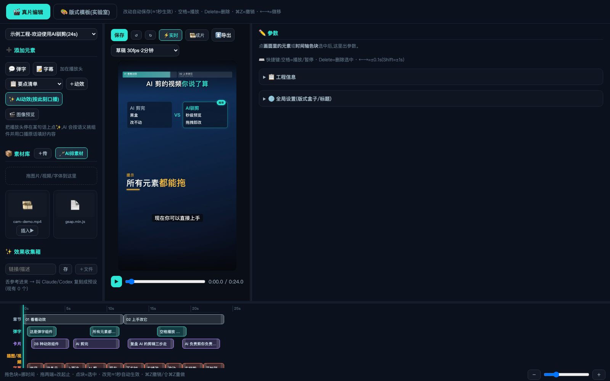
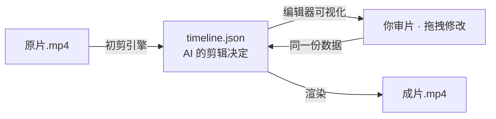

<div align="center">

# 🎬 AI驯剪 <sub>ai-xunjian</sub>

**AI 初剪，你定剪。**

开源的 AI 短视频剪辑系统：初剪引擎自动剪，AI 视频编辑器给你最终控制权

[](LICENSE)
[](#-欢迎提意见这个项目会持续更新)
[](#)



</div>

---

## ① 这个东西能干什么

一句话：**把一段口播原片丢进来，AI 自动剪成带动效的初剪；剪得不满意的每一处，你都能在可视化编辑器里直接改。**

它由两个互相咬合的模块组成，正好是一个闭环：

### 🐎 初剪引擎（firstcut/）—— AI 负责剪

一条命令，原片进、工程出：

| 步骤 | 干什么 |
|---|---|
| 探测 | 自动识别旋转元数据（手机竖拍存横档的坑）、时长、画幅 |
| **剪气口** | 静音检测，自动剪掉换气、停顿、开头结尾的空白 |
| **剪重说** | 说错→停顿→重说？自动识别紧挨着的重复句，剪掉说废的前一遍、保留重说的后一遍，打印剪除清单供核对 |
| 提速 | 默认 1.2x（口播视频的舒适语速），可调 |
| 响度归一 | 广播级 loudnorm，声音大小稳定 |
| **转写字幕** | faster-whisper 词级时间戳，自动切成 ≤14 字/行的逐字字幕 |
| **AI 初剪** | AI 通读字幕，按语义自动上章节、弹字、动效卡片（调用你自己的 LLM CLI） |

### 🎛 AI 视频编辑器 —— 你负责说了算

AI 剪的每一个元素（章节/弹字/卡片/素材/字幕）都躺在**五轨时间轴**上：

- 拖块挪时间、拉两端改起止，**改动一秒内实时生效**
- 28 种数据驱动动效组件（对比卡/印章/判定矩阵/金句卡/划线纠错……）
- 画面里直接点选拖动缩放；`⌘Z` 30 步撤销
- ✨AI 动效（按语义补单个组件）、🪄AI 排素材（AI"看"素材自动对位上片）
- 三档导出：快查 / 草稿 / 正式成片（HyperFrames 无头渲染）

### 为什么是闭环



**AI 改的和你改的是同一份 `timeline.json`**——AI 剪辑不再是黑盒抽卡，而是一份你随时可以推翻重来的草稿。

## ② 这个东西怎么用

**环境**：Node.js ≥ 20 · [ffmpeg](https://ffmpeg.org/)（`brew install ffmpeg`）· 转写需 [uv](https://docs.astral.sh/uv/)（可选）· AI 初剪需任意 LLM CLI 如 [Claude Code](https://claude.com/claude-code)（可选）

> 🤖 **不想手动装环境？让 AI 帮你装。** clone 本仓库后，在仓库目录里打开你的 AI 编程助手（Claude Code / Codex / Cursor 都行），把下面这句话发给它：
>
> ```
> 请读这个仓库根目录的 AGENTS.md，按里面的〈环境自检与安装〉帮我检查并装好缺的工具，
> 然后按〈验证序列〉跑通示例工程，最后告诉我怎么初剪我自己的视频。
> ```
>
> 仓库自带 `AGENTS.md`（AI 助手说明书）：装什么、怎么验证、缺了会怎样、Windows 注意什么，AI 照着一步步来就行。

**🪟 Windows 支持**：初剪引擎、编辑器、实时预览、AI 功能均原生支持（字幕字体自动用微软雅黑）；**正式导出（无头渲染）在原生 Windows 属实验性**，遇到问题推荐在 [WSL2](https://learn.microsoft.com/windows/wsl/install) 里跑（等同 Linux 全功能）。三平台核心链路由 GitHub Actions 持续验证。

### 第一步：跑通示例（3 分钟）

```bash
git clone https://github.com/fxl1209739475-fxl/ai-xunjian.git
cd ai-xunjian
npm install
npm run setup     # 生成演示工程
npm run dev       # 启动编辑器
```

打开 **http://127.0.0.1:5178/editor.html**，选「示例工程」，空格播放，随便拖。

### 第二步：初剪你自己的视频

```bash
node firstcut/run.mjs 你的口播原片.mp4
```

引擎会自动：剪气口 → 剪重说 → 提速 → 归一 → 转写 → AI 初剪 → 生成工程。跑完刷新编辑器，左上角就有它。

> 💡 **拍摄小技巧**：说错了不用喊停重录——停顿一秒，把那句重说一遍接着讲。引擎会识别重复句，自动剪掉说废的那遍（判定保守，宁漏勿误剪；每处剪除都打印原文供核对，报告也存在工程的 `work/retake-report.json`）。

常用参数：

```bash
node firstcut/run.mjs 原片.mp4 --name 我的第一条    # 指定工程名
node firstcut/run.mjs 原片.mp4 --speed 1.3         # 改提速倍率
node firstcut/run.mjs 原片.mp4 --no-ai             # 只做机械预处理，动效自己上
node firstcut/run.mjs 原片.mp4 --no-retake         # 关掉重说检测（发现误剪时用它重跑）
node firstcut/run.mjs 原片.mp4 --retake-sim 0.9    # 重说判定更严格（默认 0.8，越高越保守）
```

> 没装 uv / LLM CLI 也能用：引擎会优雅降级成"剪气口+提速+骨架工程"，字幕和动效在编辑器里用 ✨AI 按钮或手动补。

### 第三步：定剪与导出

编辑器里审 AI 的初剪：不满意的弹字改文案、时间不对的拖一下、缺动效的地方「＋动效」或点 ✨——然后「导出」。常用操作和快捷键：

| 操作 | 方式 |
|---|---|
| 播放/暂停 · 撤销 | `空格` · `⌘Z` |
| 挪时间 / 改起止 | 时间轴拖块 / 拉块两端；`←→` ±0.1s |
| 改文字/颜色/入场 | 点选元素 → 右栏 |
| 加元素 | 左栏 ＋弹字 / ＋字幕 / ＋动效（图像预览模式可看小样） |

### 环境变量

| 变量 | 作用 | 默认 |
|---|---|---|
| `XUNJIAN_FFMPEG` / `XUNJIAN_CLAUDE` | ffmpeg / LLM CLI 路径 | PATH 里的 `ffmpeg` / `claude` |
| `XUNJIAN_EPISODES` / `XUNJIAN_ARCHIVE` | 工程目录 / 导出目录 | `./episodes` / `./exports` |
| `XUNJIAN_WHISPER_MODEL` | 转写模型 | `small` |
| `XUNJIAN_CJK_FONT` | 中文字体（字幕子集化） | macOS 苹方黑体 |

## ③ 它的价值是什么

**1. 解决 AI 剪辑的"黑盒问题"。** 市面上的 AI 剪辑工具都是"一键生成"——快是快，但改不动：想换一个词、挪一个动效，只能重新抽卡。AI驯剪把 AI 的每个剪辑决定摊开在时间轴上，**AI 负责快，你负责对**。

**2. 剪辑结果是开放数据，不是私有工程文件。** 一切内容都在 `timeline.json`：AI 能生成它、你能可视化改它、脚本能批量处理它、版本控制能 diff 它。你的剪辑资产不被任何软件锁死。

**3. 真实生产管线，不是玩具。** 这套系统是作者每天实际出片在用的：剪气口的参数、响度标准、字幕断行规则、组件的手机安全区，都是几十条真实短视频喂出来的。你拿到的是能直接上生产的东西。

**4. 完全本地 + 自带 AI 接口。** 视频不上传任何服务器；AI 能力通过你自己的 LLM CLI 接入，用谁家模型、花多少钱，你自己定。

## 🗺 Roadmap

- [ ] 初剪引擎：多段素材合并、BGM 混音选项
- [ ] 组件库继续扩充（欢迎 Issue 点单）
- [ ] 时间轴多选/成组拖动 · timeline.json Schema 校验器
- [ ] 英文界面 / English UI

## 💬 欢迎提意见！这个项目会持续更新

这个项目源自我自己每天真实使用的 AI 剪辑流水线，**我会持续维护和更新它**——我每天都在用它出片，它不会是一个"发完就死"的仓库。

- 🐛 用着不对劲 → [提 Bug](../../issues)（有模板，一分钟填完）
- 💡 想要新功能/新组件/新动效 → [提建议](../../issues)，被采纳的直接进 Roadmap
- 🤔 不知道怎么用 → 也开 Issue 问，问题多的我会补进文档
- 🔧 想直接动手 → PR 永远欢迎

> 如果这个项目帮你驯服了你的 AI，点个 ⭐ Star 是对持续更新最大的支持。

## License

[MIT](LICENSE) — 随便用，商用也行，出片记得开心。
