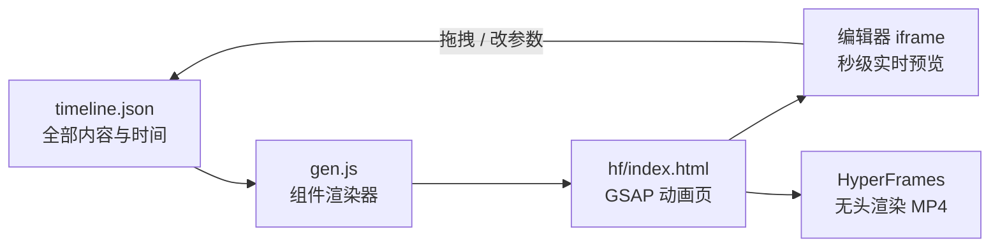

<div align="center">

# 🎬 AI驯剪 <sub>ai-xunjian</sub>

**AI 剪的视频，你说了算。**

复盘、修改、实时预览 AI 剪辑结果的可视化真片编辑器

[](LICENSE)
[](#-欢迎提意见这个项目会持续更新)
[](#)


</div>

---

## 为什么做这个

AI 已经能把口播视频剪得像模像样：切气口、上字幕、加动效、排素材。但它剪完之后，**你想改一个字、挪一个动效、删一句废话——就是无从下手**。成片是个黑盒，重新生成一次像抽卡。

**AI驯剪把控制权还给你**：AI 剪辑的每一个元素（章节、弹字、卡片、素材、字幕）都躺在一条可视化时间轴上，点谁改谁、拖谁挪谁，改动一秒内实时生效。AI 负责快，你负责说了算。

## 它能干什么

| 能力 | 说明 |
|---|---|
| 🎞 **五轨时间轴** | 章节 / 弹字 / 卡片 / 插图视频 / 字幕，全部可拖拽：拖块挪时间、拉两端改起止 |
| ⚡ **秒级实时预览** | 任何改动自动保存（~1 秒防抖）并即刻反映在预览画面里，无需手动刷新 |
| 🧩 **28 种动效组件** | 要点清单、左右对比、印章判词、划线纠错、逐词公式、数据飞轮、判定矩阵、金句卡……全部数据驱动 |
| 🖱 **画面直选直拖** | 在预览画面里直接点选元素、拖动位置、右下角缩放 |
| ✨ **AI 动效**（可选） | 把播放头停在某句话上，AI 读上下文语义，自动挑组件并用口播原话填好内容 |
| 🪄 **AI 排素材**（可选） | AI 逐个"看"你的素材图/视频，对照口播语义自动排进时间轴，不相关的主动跳过 |
| 📤 **三档导出** | 快查 15fps / 草稿 30fps / 正式成片（基于 [HyperFrames](https://www.npmjs.com/package/hyperframes) 无头渲染） |
| 📁 **数据驱动** | 一切内容都在 `timeline.json`，人改、AI 改、脚本改都是同一份数据，永不失控 |

## 🚀 快速开始（3 分钟跑起来）

**环境要求**：Node.js ≥ 20，[ffmpeg](https://ffmpeg.org/)（macOS 可 `brew install ffmpeg`）

```bash
# 1. 克隆并安装
git clone https://github.com/fxl1209739475-fxl/ai-xunjian.git
cd ai-xunjian
npm install

# 2. 一键准备示例工程（生成演示视频 + 渲染预览页）
npm run setup

# 3. 启动编辑器
npm run dev
```

打开浏览器访问 **http://127.0.0.1:5178/editor.html**，左上角选择示例工程「示例工程-欢迎使用AI驯剪」，按空格播放——你会看到一条完全由组件构成的演示片，然后就可以随便拖、随便改了。

## 📖 怎么用

### 界面布局（剪映式三栏）

```
┌────────────┬──────────────┬────────────┐
│ 左：添加元素 │  中：实时预览   │ 右：选中参数 │
│ 弹字/字幕/  │  播放条/保存/   │ 文字/颜色/  │
│ 组件/素材库 │  成片/导出     │ 时间/入场   │
├────────────┴──────────────┴────────────┤
│         底部：五轨时间轴（可拖拽）          │
└─────────────────────────────────────────┘
```

### 常用操作

| 想做什么 | 怎么做 |
|---|---|
| 播放 / 暂停 | `空格` |
| 挪一个元素的时间 | 时间轴上拖动色块；拖左缘改开始、右缘改结束 |
| 改文字 / 颜色 / 入场动画 | 点选元素 → 右栏改参数 |
| 挪画面里的插图 | 预览画面里点选 → 直接拖动，右下角缩放 |
| 加一条弹字 / 字幕 | 左栏「＋弹字」「＋字幕」，插在播放头位置 |
| 加动效组件 | 左栏下拉选组件 →「＋动效」；或点「🎬 图像预览」看小样直接插 |
| 撤销 | `⌘Z`（30 步） |
| 微调时间 | 选中后 `←` `→`（±0.1s），`Shift` + 方向键（±1s） |
| 导出成片 | 中栏「导出」，三档画质任选 |

### 接入你自己的视频

每条片一个目录，放在 `episodes/` 下：

```
episodes/我的视频/
├── gen.js               # 渲染器（从 episodes/demo/gen.js 复制即可）
├── timeline.json        # 全部内容都在这（参考 demo 的结构）
├── work/
│   └── caps-full.json   # 字幕 [{s,e,z}]（秒 + 文本）
└── hf/assets/
    ├── cam-你的视频.mp4  # 你的原片（竖屏 1080x1920 最佳）
    └── gsap.min.js      # 从 demo 目录复制
```

三步走：

1. **建目录**：照上面结构放好你的视频，`timeline.json` 里 `meta.cam` 指向视频文件名
2. **写内容**：手写 `timeline.json`（结构自解释，照 demo 抄），或者让你的 AI（Claude / GPT / 任意 Agent）按你的口播生成——这正是本项目的设计初衷：**AI 出初稿，你来驯服**
3. **刷新编辑器**：左上角下拉里会出现新工程，选中开改

### 可选：接通 AI 能力

「✨AI 动效」和「🪄AI 排素材」通过命令行调用 [Claude Code](https://claude.com/claude-code)：

```bash
# 装好 claude CLI 后即插即用；也可以用环境变量指定其它入口
export XUNJIAN_CLAUDE=/path/to/claude
```

没装也完全不影响手动编辑的全部功能。

### 环境变量一览

| 变量 | 作用 | 默认 |
|---|---|---|
| `XUNJIAN_FFMPEG` | ffmpeg 路径 | `ffmpeg`（PATH） |
| `XUNJIAN_EPISODES` | 工程根目录 | `./episodes` |
| `XUNJIAN_ARCHIVE` | 成片导出目录 | `./exports` |
| `XUNJIAN_CLAUDE` | Claude CLI 路径（AI 功能） | `claude` |
| `XUNJIAN_CJK_FONT` | 中文字体文件（字幕子集化用） | macOS 系统苹方黑体 |
| `XUNJIAN_BGM` | 默认背景音乐 | 无 |

## 🏗 工作原理



核心思想只有一句话：**视频 = 数据（timeline.json）+ 渲染（gen.js）**。所以 AI 可以生成它、你可以可视化改它、脚本可以批量处理它——三方改的是同一份东西，谁也不会把谁锁死。

## 🗺 Roadmap

- [ ] 组件库继续扩充（欢迎在 Issue 里点单）
- [ ] 时间轴多选 / 成组拖动
- [ ] timeline.json Schema 文档与校验器
- [ ] 英文界面 / English UI
- [ ] 更多渲染后端适配

## 💬 欢迎提意见！这个项目会持续更新

这个项目源自我自己每天真实使用的 AI 剪辑流水线，**我会持续维护和更新它**——你在 Roadmap 里看到的每一项都会逐步落地，而且我每天都在用它出片，它不会是一个"发完就死"的仓库。

**任何反馈都欢迎，直接开 [Issue](../../issues)**：

- 🐛 用着不对劲 → 提 Bug（有模板，一分钟填完）
- 💡 想要新功能 / 新组件 / 新动效 → 提建议，被采纳的直接进 Roadmap
- 🤔 不知道怎么用 → 也开 Issue 问，问题多的我会补进文档
- 🔧 想直接动手 → PR 永远欢迎，小改动不用先问

> 如果这个项目帮你驯服了你的 AI，点个 ⭐ Star 是对持续更新最大的支持。

## License

[MIT](LICENSE) — 随便用，商用也行，出片记得开心。
